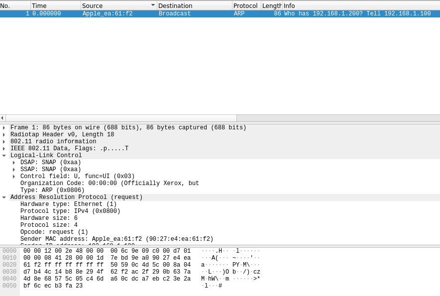
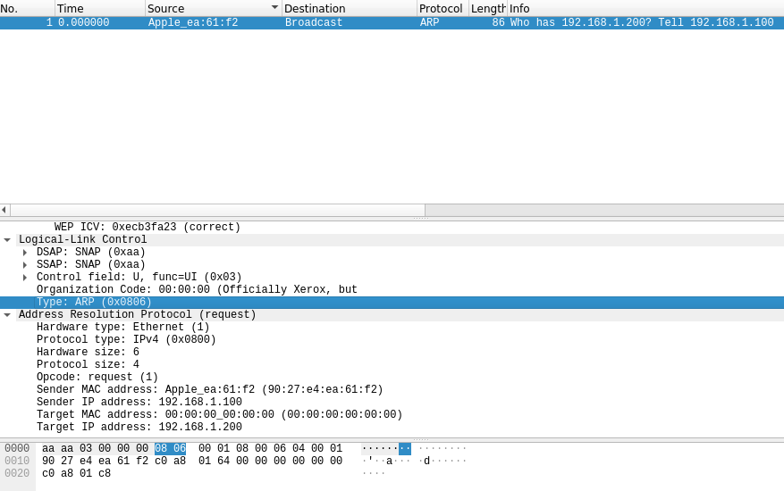
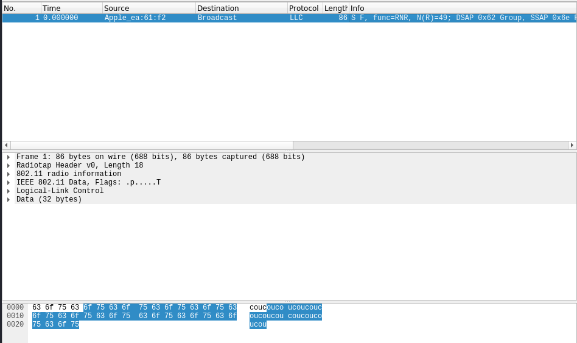

[Livrables](https://github.com/arubinst/HEIGVD-SWI-Labo-WEP3#livrables)

[Échéance](https://github.com/arubinst/HEIGVD-SWI-Labo3-WEP#échéance)

[Travail à réaliser](https://github.com/arubinst/HEIGVD-SWI-Labo3-WEP#travail-à-réaliser)

# Sécurité des réseaux sans fil

## Laboratoire 802.11 Sécurité WEP

__A faire en équipes de deux personnes__

### Pour cette partie pratique, vous devez être capable de :

* Déchiffrer manuellement des trames WEP utilisant Python et Scapy
* Chiffrer manuellement des trames WEP utilisant Python et Scapy
* Forger des fragments protégés avec WEP afin d’obtenir une keystream de longueur plus grande que 8 octets


Vous allez devoir faire des recherches sur internet pour apprendre à utiliser Scapy et la suite aircrack pour vos manipulations. __Il est fortement conseillé d'employer une distribution Kali__ (on ne pourra pas assurer le support avec d'autres distributions). __Si vous utilisez une VM, il vous faudra une interface WiFi usb, disponible sur demande__.

__ATTENTION :__ Pour vos manipulations, il pourrait être important de bien fixer le canal lors de vos captures et vos injections. Si vous en avez besoin, la méthode la plus sure est d'utiliser l'option :

```--channel``` de ```airodump-ng```

et de garder la fenêtre d'airodump ouverte en permanence pendant que vos scripts tournent ou vos manipulations sont effectuées.

Pour les interfaces Alfa AWUS036ACH (interfaces noires), __il faut activer la compatibilité USB 3.0 sur votre VM__. Pour toute autre interface, il faudra utiliser USB 2.0 sur votre VM. __Les ports USB configurés en 1.0 ou 1.1 ne sont pas assez rapides pour sniffer du WiFi__.

Pour passer une interface __Alfa AWUS036H, AWUS036NH et très probablement l'interface de votre propre laptop__ en mode monitor, il faudra utiliser la commande suivante (vérifiez avec ```ifconfig```que votre interface s'appelle bien ```wlan0```. Sinon, utilisez le nom correct dans la commande):

```bash
sudo airmon-ng start wlan0
```

Vous retrouverez ensuite une nouvelle interface ```wlan0mon``` qui fonctionne en mode monitor.

Si vous utilisez les interfaces Alfa __AWUS036ACH__ (interfaces noires), il faudra faire les manipulations suivantes pour les configurer en mode monitor. __ATTENTION, utilisez les commandes suivantes uniquement si vous utilisez les interfaces AWUS036ACH__ :

### Installer le driver (disponible sur Kali. Pour d'autres distributions, il faudra probablement le compiler à partir des sources) :

```bash
sudo apt-get install realtek-rtl88xxau-dkms
```

Ensuite, pour passer en mode monitor :

### Mettre l'interface “down”

```bash
sudo ip link set wlan0 down
```

### Configurer le mode monitor

```bash
sudo iwconfig wlan0 mode monitor
```

### Si vous devez compiler le driver :

```bash
git clone https://github.com/astsam/rtl8812au.git
cd rtl8812au
make
sudo make install
```

## Travail à réaliser

### 1. Déchiffrement manuel de WEP

Dans cette partie, vous allez récupérer le script Python `manual-decryption.py`. Il vous faudra également le fichier de capture `arp.cap` contenant un message arp chiffré avec WEP et la librairie `rc4.py` pour générer les keystreams indispensables pour chiffrer/déchiffrer WEP. Tous les fichiers doivent être copiés dans le même répertoire local sur vos machines.

- Ouvrir le fichier de capture `arp.cap` avec Wireshark
   
- Utiliser Wireshark pour déchiffrer la capture. Pour cela, il faut configurer dans Wireshark la clé de chiffrement/déchiffrement WEP (Dans Wireshark : Preferences&rarr;Protocols&rarr;IEEE 802.11&rarr;Decryption Keys). Il faut également activer le déchiffrement dans la fenêtre IEEE 802.11 (« Enable decryption »). Vous trouverez la clé dans le script Python `manual-decryption.py`.
   
- Exécuter le script avec `python manual-decryption.py`
   
- Comparer la sortie du script avec la capture text déchiffrée par Wireshark
   
- Analyser le fonctionnement du script

### 2. Chiffrement manuel de WEP

Utilisant le script `manual-decryption.py` comme guide, créer un nouveau script `manual-encryption.py` capable de chiffrer un message, l’enregistrer dans un fichier pcap et l’envoyer.
Vous devrez donc créer votre message, calculer le contrôle d’intégrité (ICV), et les chiffrer (voir slides du cours pour les détails).


### Quelques éléments à considérer :

- Vous pouvez utiliser la même trame fournie comme « template » pour votre trame forgée (conseillé). Il faudra mettre à jour le champ de données qui transporte le message (`wepdata`) et le contrôle d’intégrite (`icv`).
- Le champ `wepdata` accepte des données en format text.
- Le champ `icv` accepte des données en format « long ».
- Vous pouvez vous guider à partir du script fourni pour les différentes conversions de formats qui pourraient être nécessaires.
- Vous pouvez exporter votre nouvelle trame en format pcap utilisant Scapy et ensuite, l’importer dans Wireshark. Si Wireshark est capable de déchiffrer votre trame forgée, elle est correcte !


### 3. Fragmentation

Dans cette partie, vous allez enrichir votre script développé dans la partie précédente pour chiffrer 3 fragments.

### Quelques éléments à considérer :

- Chaque fragment est numéroté. La première trame d’une suite de fragments a toujours le numéro de fragment à 0. Une trame entière (sans fragmentation) comporte aussi le numéro de fragment égal à 0
- Pour incrémenter le compteur de fragments, vous pouvez utiliser le champ « SC » de la trame. Par exemple : `trame.SC += 1`
- Tous les fragments sauf le dernier ont le bit `more fragments` à 1, pour indiquer qu’un nouveau fragment va être reçu
- Le champ qui contient le bit « more fragments » est disponible en Scapy dans le champ `FCfield`. Il faudra donc manipuler ce champ pour vos fragments. Ce même champ est visible dans Wireshark dans IEEE 802.11 Data &rarr; Frame Control Field &rarr; Flags
- Pour vérifier que cette partie fonctionne, vous pouvez importer vos fragments dans Wireshark, qui doit être capable de les recomposer
- Pour un test encore plus intéressant (optionnel), vous pouvez utiliser un AP (disponible sur demande) et envoyer vos fragments. Pour que l’AP accepte vous données injectées, il faudra faire une « fake authentication » que vous pouvez faire avec `aireplay-ng`
- Si l’AP accepte vos fragments, il les recomposera et les retransmettra en une seule trame non-fragmentée !

## Livrables

Un fork du repo original . Puis, un Pull Request contenant :

-	Script de chiffrement WEP **abondamment commenté/documenté**
  - Fichier pcap généré par votre script contenant la trame chiffrée
  - Capture d’écran de votre trame importée et déchiffré par Wireshark

    Capture d’écran de la trame fourni pour le labo
    
    

    Capture d’écran de notre trame déchiffré
    

-	Script de fragmentation **abondamment commenté/documenté**
  - Fichier pcap généré par votre script contenant les fragments
  - Capture d’écran de vos trames importées et déchiffrés par Wireshark 

-	Envoyer le hash du commit et votre username GitHub par email au professeur et à l'assistant


## Échéance

Le 03 avril 2020 à 23h59
